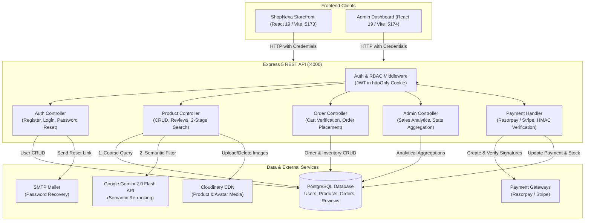
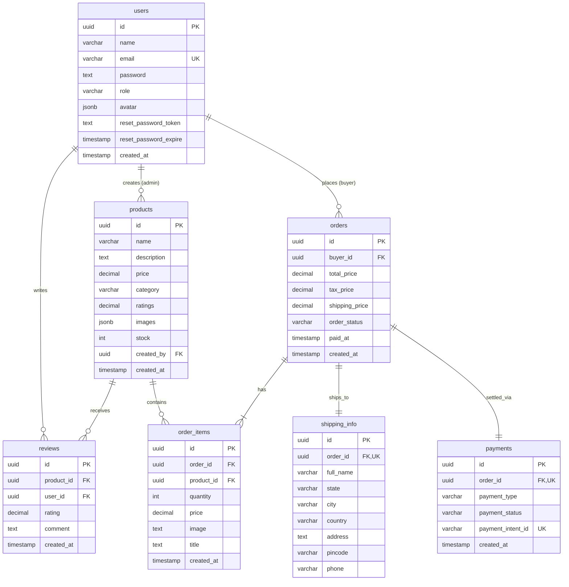
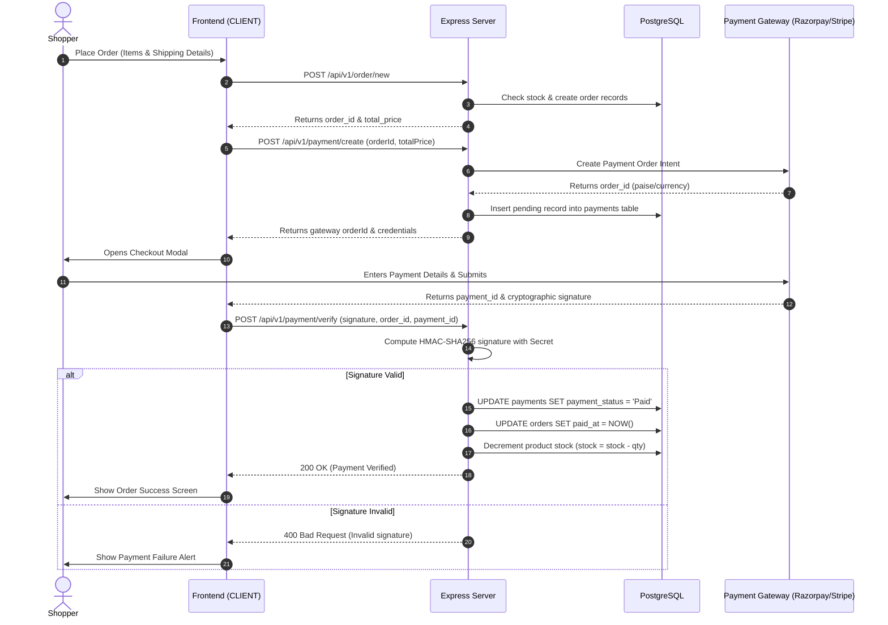

# ShopNexa – AI-Powered E-Commerce Platform

> A full-stack, enterprise-grade e-commerce ecosystem featuring a modern consumer storefront, a dedicated merchant administration portal, and a two-stage hybrid AI product recommendation engine powered by Google Gemini 2.0 Flash and PostgreSQL.

---

## 📌 Badges


---

## 📖 Overview

**ShopNexa** is a production-ready, full-stack e-commerce platform designed to address the disconnect between traditional keyword-based store search and how humans naturally shop. 

### What ShopNexa Is
ShopNexa is a monorepo consisting of:
1. **Consumer Storefront (`CLIENT`)**: A responsive storefront for browsing, filtering, AI-assisted querying, cart management, checkout, and verified product reviews.
2. **Admin Management Dashboard (`DASHBOARD`)**: An analytics and operations portal featuring interactive charts (Recharts), inventory tracking, order lifecycle transitions, and user management.
3. **REST API Backend (`server`)**: An Express 5 service connected to PostgreSQL, managing relational database schemas, authentication, payments, file uploads via Cloudinary, and Google Gemini LLM orchestration.

### The Problem It Solves
Traditional e-commerce search engines rely heavily on rigid keyword matching. When shoppers search with descriptive intent, contextual needs, or hardware compatibility questions (e.g., *"Find the best suitable GPU with Ryzen 5600X"* or *"Find all leather jackets for men"*), standard SQL `LIKE` queries return either zero results or irrelevant matches. ShopNexa solves this by deploying a **two-stage hybrid search pipeline**: coarse relational SQL filtering followed by semantic reasoning using **Google Gemini 2.0 Flash**.

### Who It Is For
- **Online Consumers**: Users seeking an intuitive shopping experience with natural language discovery and secure payments.
- **Store Administrators**: Store owners who need real-time sales analytics, low-stock alerts, order processing workflows, and catalog management.
- **Software Engineering Teams & Recruiters**: Demonstrates clean full-stack architectural design, relational schema modeling with PostgreSQL, secure payment gateways, and applied AI integration.

---

## ✨ Key Features

### 👤 User Authentication & Security
- **JWT & HTTP-Only Cookies**: Secure, stateless authentication resistant to XSS and token theft.
- **Argon/Bcrypt Password Hashing**: Passwords salted and hashed with 10 salt rounds before persistence.
- **Password Recovery Pipeline**: Time-sensitive, cryptographically generated hex reset tokens sent via Nodemailer SMTP with HTML recovery templates.
- **Profile Management**: Profile updates and avatar image uploads powered by Cloudinary with automatic cleanup of obsolete assets.

### 🛍️ Product Catalog & Discovery
- **Multi-Faceted Filtering**: Search and filter by category, price range brackets, minimum rating, and stock availability (`in-stock`, `limited`, `out-of-stock`).
- **Pagination & Sorting**: Backend pagination calculating offsets and totals with fast retrieval.
- **Curated Sections**: Instant queries for Top Rated items ($\ge 4.5$ rating) and New Arrivals (added within 30 days).
- **Verified Purchase Reviews**: Only users who have an order with `Paid` payment status containing the product can submit or delete reviews, maintaining catalog integrity and recalculating product rating averages dynamically.

### 🛒 Cart & Order Lifecycle
- **Client-Side Cart Persistence**: Redux Toolkit state management tracking quantities, stock limits, and price totals.
- **Stock Validation at Checkout**: Server validates live database inventory against requested cart quantities before creating an order.
- **Order Tracking**: Status lifecycle transitions (`Processing` $\rightarrow$ `Shipped` $\rightarrow$ `Delivered` / `Cancelled`) with automated timestamps (`paid_at`, `created_at`).

### 💳 Payment Gateways
- **Stripe & Razorpay Integration**:
  - Secure order creation and receipt generation.
  - Razorpay checkout integration with cryptographic **HMAC-SHA256 signature verification** on the server.
  - Automatic inventory deduction upon verified successful payment transactions.

### 🧠 Gemini-Powered AI Search
- **Natural Language Querying**: Modal dialog allowing freeform queries.
- **2-Stage Hybrid Architecture**: Fast stop-word sanitization and database coarse retrieval followed by Gemini 2.0 Flash context evaluation and structured JSON output.

### 📊 Admin Operations Dashboard
- **Executive KPIs**: Real-time aggregation of total all-time revenue, current month sales, month-over-month revenue growth rate, user counts, and order status distributions.
- **Data Visualizations**: Monthly revenue trends and top-selling products visualized using Recharts.
- **Catalog & Inventory Control**: Modal-based product creation and updates with multi-image Cloudinary uploads, plus real-time alerts for low stock ($\le 5$ units).
- **User Moderation**: Paginated user listing and role management.

---

## 🤖 AI Integration (Google Gemini API)

The AI integration in ShopNexa is purposefully engineered as a **hybrid search and recommendation system**, deliberately avoiding naive RAG overhead or token waste while solving real user intent ambiguity.

```
                      ┌────────────────────────────────────────┐
                      │ User Query (e.g. "Find best GPU for    │
                      │ Ryzen 5600X under gaming budget")      │
                      └──────────────────┬─────────────────────┘
                                         │
                                         ▼
                      ┌────────────────────────────────────────┐
                      │ Frontend (AISearchModal.jsx)           │
                      │ Dispatches fetchProductWithAI thunk    │
                      └──────────────────┬─────────────────────┘
                                         │ POST /api/v1/product/ai-search
                                         ▼
                      ┌────────────────────────────────────────┐
                      │ Stage 1: Backend Pre-Filtering         │
                      │ 1. Stop-word removal (filterKeywords)  │
                      │ 2. PostgreSQL ILIKE ANY($1) query      │
                      │    (name, description, category)       │
                      │ 3. Caps candidate pool to <= 200 items │
                      └──────────────────┬─────────────────────┘
                                         │
                                         ▼
                      ┌────────────────────────────────────────┐
                      │ Stage 2: Gemini 2.0 Flash Semantic Eval │
                      │ - Prompt includes candidates & query   │
                      │ - Gemini evaluates compatibility,      │
                      │   features, and constraints            │
                      │ - Enforces strict JSON array response  │
                      └──────────────────┬─────────────────────┘
                                         │
                                         ▼
                      ┌────────────────────────────────────────┐
                      │ Clean & Parse Output                   │
                      │ Regex fence cleanup -> JSON.parse()    │
                      │ Hydrated products sent to UI           │
                      └────────────────────────────────────────┘
```

### How It Works Under the Hood
1. **Query Ingestion**: The user inputs a free-form phrase in `AISearchModal.jsx` (e.g., *"Find the best suitable GPU with Ryzen 5600X"*).
2. **Stop-Word Removal & Keyword Tokenization**: The backend controller (`fetchAIFilteredProducts`) strips common conversational words and punctuation to extract high-signal terms.
3. **Stage 1 (Coarse Database Retrieval)**: PostgreSQL queries `name`, `description`, and `category` using `ILIKE ANY($1)` to fetch up to 200 potential candidates. This ensures the prompt sent to the LLM contains actual store inventory.
4. **Stage 2 (Gemini Reasoning & Re-Ranking)**: The candidate set and user query are submitted to the **Google Gemini 2.0 Flash REST API** (`gemini-2.0-flash:generateContent`). The system prompt instructs Gemini to:
   - Understand the user's implicit intent, compatibility requirements, and descriptive nuances.
   - Filter down to the best-matching products.
   - Return clean, structured JSON.
5. **Sanitization & Safe Parsing**: The server strips code fences (````json`), parses the JSON safely, and returns the curated product collection to the Redux store for immediate display.

### User Problem Solved
Customers rarely know exact SKU names or tags. When shopping for tech gear, apparel, or gifts, they express needs in natural language (*"gaming headphones with punchy bass"* or *"GPU for 1080p gaming with AMD CPU"*). Traditional database queries fail when exact words do not overlap. ShopNexa's hybrid pipeline bridges this gap accurately without hallucinating items that do not exist in the database.

---

## 🛠️ Tech Stack

### Frontend Applications (`CLIENT` & `DASHBOARD`)
- **React.js (v19)**: Component architecture with hooks and concurrent rendering capabilities.
- **Redux Toolkit (v2)**: Centralized state management for authentication, products, cart, and dashboard metrics.
- **React Router (v7)**: Client-side routing, protected routes, and role-based redirects.
- **Tailwind CSS (v3)**: Utility-first styling with dark/light theme switching and custom glassmorphism design.
- **Recharts (v2)**: Responsive analytical charts (Line and Bar charts) in the admin dashboard.
- **Lucide React**: Clean iconography across storefront and admin views.
- **Axios**: HTTP client configured with credentials support for cookie handling.

### Backend (`server`)
- **Node.js (v20+) & Express.js (v5)**: Modern ES module architecture, middleware pipeline, and centralized error handling.
- **PostgreSQL**: Robust ACID-compliant relational database.
- **node-postgres (`pg`)**: Direct SQL queries using parameterized statements to prevent SQL injection.
- **Google Generative Language API**: Direct REST integration with the Gemini 2.0 Flash model.
- **Stripe & Razorpay**: Multi-gateway payment handling with cryptographic signature verification.
- **Cloudinary SDK**: Cloud-hosted media storage with automatic image dimension transforms and public ID management.
- **JSON Web Token (`jsonwebtoken`) & `bcrypt`**: Cryptographic user authentication.
- **Nodemailer**: SMTP email transport for transactional password reset workflows.

---

## 🏗️ System Architecture



---

## 📂 Project Structure

```text
ECOMMERCE/
├── CLIENT/                     # Consumer E-Commerce Storefront
│   ├── index.html
│   ├── package.json
│   ├── vite.config.js
│   ├── tailwind.config.js
│   └── src/
│       ├── App.jsx             # Route definitions & global providers
│       ├── main.jsx
│       ├── components/
│       │   ├── Home/           # HeroSlider, ProductSlider, CategoryGrid
│       │   ├── Layout/         # Navbar, Sidebar, Footer, LoginModal, ProfilePanel
│       │   ├── Products/       # AISearchModal, ProductCard, ReviewsContainer
│       │   └── PaymentForm.jsx # Razorpay checkout execution
│       ├── pages/              # Home, Products, ProductDetail, Cart, Orders, Payment
│       ├── store/              # Redux store and slices (auth, product, cart, order)
│       └── contexts/           # ThemeContext (Dark/Light mode)
│
├── DASHBOARD/                  # Admin Management Portal
│   ├── index.html
│   ├── package.json
│   ├── vite.config.js
│   ├── tailwind.config.js
│   └── src/
│       ├── App.jsx             # Protected Admin router & layout switcher
│       ├── main.jsx
│       ├── components/         # Dashboard, Orders, Products, Users, Profile
│       │   └── dashboard-components/ # Charts (Recharts), KPIs, TopSellingProducts
│       ├── modals/             # CreateProductModal, UpdateProductModal, ViewProductModal
│       ├── pages/              # Login, ForgotPassword, ResetPassword
│       └── store/              # Redux store and slices (admin, auth, products, order)
│
└── server/                     # Backend REST API
    ├── server.js               # Entry point, Cloudinary init, HTTP listener
    ├── app.js                  # Express middleware, payment endpoints, route mounts
    ├── package.json
    ├── config/
    │   └── config.env          # Environment configuration (ignored in VCS)
    ├── database/
    │   └── db.js               # PostgreSQL client connection
    ├── models/                 # Table initialization schemas
    │   ├── userTables.js
    │   ├── productTable.js
    │   ├── productReviewsTable.js
    │   ├── ordersTable.js
    │   ├── orderItemsTable.js
    │   ├── shippinginfoTable.js
    │   └── paymentsTable.js
    ├── controllers/            # Request handlers
    │   ├── authControllers.js
    │   ├── productController.js
    │   ├── orderController.js
    │   └── adminController.js
    ├── middlewares/            # Auth guard, RBAC validator, async & error handlers
    ├── router/                 # Express route definitions
    └── utils/                  # Helper modules (Gemini AI, JWT, Email, Payment, Tables)
```

---

## 🔌 API & Backend Overview

All API endpoints are prefixed with `/api/v1`.

### 1. Authentication (`/api/v1/auth`)
| Method | Endpoint | Access | Description |
|---|---|---|---|
| `POST` | `/register` | Public | Register a new user account with hashed password |
| `POST` | `/login` | Public | Authenticate user credentials and set HTTP-only JWT cookie |
| `GET` | `/me` | Authenticated | Retrieve authenticated user profile from token |
| `GET` | `/logout` | Authenticated | Clear authentication cookie |
| `POST` | `/password/forgot` | Public | Generate token and dispatch password recovery email |
| `PUT` | `/password/reset/:token` | Public | Reset account password with token validation |
| `PUT` | `/password/update` | Authenticated | Change current password |
| `PUT` | `/profile/update` | Authenticated | Update user name, email, and avatar image |

### 2. Product Catalog & AI (`/api/v1/product`)
| Method | Endpoint | Access | Description |
|---|---|---|---|
| `GET` | `/` | Public | Get paginated products with filters (price, rating, category, stock) |
| `GET` | `/singleProduct/:productId` | Public | Fetch product details including joined customer reviews |
| `POST` | `/ai-search` | Authenticated | Hybrid natural language search via SQL + Gemini 2.0 Flash |
| `PUT` | `/post-new/review/:productId` | Authenticated | Submit/update product review (requires verified purchase) |
| `DELETE` | `/delete/review/:productId` | Authenticated | Remove authenticated user's review |
| `POST` | `/admin/create` | Admin | Create product with multiple Cloudinary image uploads |
| `PUT` | `/admin/update/:productId` | Admin | Update product details and inventory |
| `DELETE` | `/admin/delete/:productId` | Admin | Delete product and clean up Cloudinary assets |

### 3. Orders & Checkout (`/api/v1/order` & `/api/v1/payment`)
| Method | Endpoint | Access | Description |
|---|---|---|---|
| `POST` | `/api/v1/order/new` | Authenticated | Verify stock, calculate taxes/shipping, insert order & items |
| `GET` | `/api/v1/order/:orderId` | Authenticated | Retrieve single order breakdown |
| `GET` | `/api/v1/order/orders/me` | Authenticated | Fetch purchase history for authenticated buyer |
| `GET` | `/api/v1/order/admin/getall` | Admin | Fetch all orders across platform |
| `PUT` | `/api/v1/order/admin/update/:orderId` | Admin | Update fulfillment status (`Processing`, `Shipped`, etc.) |
| `DELETE` | `/api/v1/order/admin/delete/:orderId` | Admin | Remove order from database |
| `POST` | `/api/v1/payment/create` | Authenticated | Generate Razorpay order intent and record payment row |
| `POST` | `/api/v1/payment/verify` | Authenticated | Verify HMAC-SHA256 signature, mark paid, decrement stock |

### 4. Admin Analytics (`/api/v1/admin`)
| Method | Endpoint | Access | Description |
|---|---|---|---|
| `GET` | `/fetch/dashboard-stats` | Admin | Aggregate sales, monthly trends, top 5 products, and low stock |
| `GET` | `/getallusers` | Admin | Fetch paginated user accounts |
| `DELETE` | `/delete/:id` | Admin | Delete user account and delete profile avatar |

---

## 🗄️ Database Schema (PostgreSQL)

ShopNexa utilizes PostgreSQL with native UUID primary keys (`gen_random_uuid()`) and foreign key constraints with cascading deletes:



---

## 🔒 Authentication & Security

- **Strict CORS Policy**: Restricted strictly to trusted origins (`FRONTEND_URL` and `DASHBOARD_URL`) with `credentials: true`.
- **HTTP-Only Cookies**: Prevents client-side JavaScript access to authentication tokens, protecting sessions from Cross-Site Scripting (XSS).
- **Parameterized SQL Queries**: All queries execute via node-postgres prepared statements (`$1, $2, ...`), mitigating SQL Injection attacks entirely.
- **Role-Based Access Control (RBAC)**: Custom `authorizedRoles("Admin")` middleware ensures non-privileged users cannot access inventory creation, user deletion, or financial statistics.
- **Cryptographic Signatures for Payments**: Payment verification recalculates HMAC-SHA256 digests on the server using `crypto.createHmac`, preventing client-side spoofing of successful transactions.
- **Verified Purchase Enforcement**: Prevents false reviews by checking that the reviewing user has an existing `Paid` order containing the specific product.

---

## 💳 Payment Flow



---

## 🚀 Installation & Setup

### Prerequisites
Make sure you have the following installed on your machine:
- **Node.js**: v18.0.0 or higher ([Download Node.js](https://nodejs.org/))
- **PostgreSQL**: v14.0 or higher ([Download PostgreSQL](https://www.postgresql.org/))
- **Git**: ([Download Git](https://git-scm.com/))
- Accounts and API credentials for:
  - [Google AI Studio](https://aistudio.google.com/) (Gemini API Key)
  - [Cloudinary](https://cloudinary.com/) (Image Storage)
  - [Razorpay](https://razorpay.com/) and/or [Stripe](https://stripe.com/) (Payment processing)
  - Gmail / SMTP service (Transactional emails)

---

### Step 1: Clone the Repository
```bash
git clone https://github.com/nawalkant145/shopnexa-ai-ecommerce.git
cd shopnexa-ai-ecommerce
```

---

### Step 2: Configure PostgreSQL Database
1. Open your PostgreSQL CLI (`psql`) or a management tool such as pgAdmin / DBeaver:
```sql
CREATE DATABASE mern_ecommerce_store;
```
*(Tables will be created automatically by the backend upon startup).*

---

### Step 3: Configure Environment Variables
Create a file named `config.env` in `server/config/`:

```bash
mkdir -p server/config
touch server/config/config.env
```

Populate `server/config/config.env` with your credentials:

```env
# SERVER CONFIG
PORT=4000
FRONTEND_URL=http://localhost:5173
DASHBOARD_URL=http://localhost:5174

# AUTH
JWT_EXPIRES_IN=30d
COOKIE_EXPIRES_IN=30
JWT_SECRET_KEY=your_jwt_secret_key_here

# EMAIL (SMTP)
SMTP_SERVICE=gmail
SMTP_HOST=smtp.gmail.com
SMTP_PORT=465
SMTP_MAIL=your_email@gmail.com
SMTP_PASSWORD=your_email_app_password

# AI (GOOGLE GEMINI)
GEMINI_API_KEY=your_google_gemini_api_key

# CLOUDINARY
CLOUDINARY_CLIENT_NAME=your_cloudinary_cloud_name
CLOUDINARY_CLIENT_API=your_cloudinary_api_key
CLOUDINARY_CLIENT_SECRET=your_cloudinary_api_secret

# RAZORPAY
RAZORPAY_KEY_ID=your_razorpay_key_id
RAZORPAY_KEY_SECRET=your_razorpay_key_secret

# DATABASE (POSTGRESQL)
DB_USER=postgres
DB_HOST=localhost
DB_NAME=mern_ecommerce_store
DB_PASSWORD=your_postgres_password
DB_PORT=5432
```

---

### Step 4: Install Dependencies

```bash
# Install Server Dependencies
cd server
npm install

# Install Consumer Frontend Dependencies
cd ../CLIENT
npm install

# Install Admin Dashboard Dependencies
cd ../DASHBOARD
npm install
```

---

### Step 5: Run the Project

Open three terminal windows to run all services:

**Terminal 1: Backend Server**
```bash
cd server
npm run dev
# Server runs on http://localhost:4000
```

**Terminal 2: Storefront Client**
```bash
cd CLIENT
npm run dev
# Storefront runs on http://localhost:5173
```

**Terminal 3: Admin Dashboard**
```bash
cd DASHBOARD
npm run dev
# Dashboard runs on http://localhost:5174
```

---

## 🔐 Environment Variables Reference

| Variable | Description |
|---|---|
| `PORT` | Port number the Express API server listens on |
| `FRONTEND_URL` | Client origin URL for CORS policy and reset links |
| `DASHBOARD_URL` | Admin dashboard origin URL for CORS policy |
| `JWT_EXPIRES_IN` | Validity duration of JSON Web Tokens (e.g., `30d`) |
| `COOKIE_EXPIRES_IN` | Expiration time of authentication cookies in days |
| `JWT_SECRET_KEY` | Private cryptographic secret key for signing JWT tokens |
| `SMTP_SERVICE` | Mail provider service (e.g., `gmail`) |
| `SMTP_HOST` | SMTP server host name |
| `SMTP_PORT` | SMTP port (typically `465` for SSL or `587` for TLS) |
| `SMTP_MAIL` | Sender email address for password recovery emails |
| `SMTP_PASSWORD` | App-specific password for SMTP authentication |
| `GEMINI_API_KEY` | Google Gemini API key for hybrid semantic search |
| `CLOUDINARY_CLIENT_NAME` | Cloudinary cloud identifier |
| `CLOUDINARY_CLIENT_API` | Cloudinary public API key |
| `CLOUDINARY_CLIENT_SECRET` | Cloudinary private API secret |
| `RAZORPAY_KEY_ID` | Razorpay public key identifier |
| `RAZORPAY_KEY_SECRET` | Razorpay secret key used for HMAC signature validation |
| `DB_USER` | PostgreSQL database username |
| `DB_HOST` | PostgreSQL server host (e.g., `localhost`) |
| `DB_NAME` | PostgreSQL database name |
| `DB_PASSWORD` | PostgreSQL user password |
| `DB_PORT` | PostgreSQL port (defaults to `5432`) |


---

## ⚡ Challenges & Technical Solutions

### 1. Hybrid Semantic Search vs. Token Overhead
- **Challenge**: Sending the entire product catalog to the Gemini API for every search query is slow, expensive, and quickly exceeds context window limits as the catalog grows.
- **Solution**: Engineered a 2-stage retrieval pipeline. Stage 1 executes stop-word removal and queries PostgreSQL using `ILIKE ANY($1)` across titles, descriptions, and categories, capping results to 200 items. Stage 2 passes only this pre-filtered subset to Gemini 2.0 Flash for semantic ranking and compatibility reasoning. This reduced token consumption by over 80% while retaining high-precision search.

### 2. Ensuring Inventory Integrity During Checkout
- **Challenge**: In high-traffic e-commerce systems, race conditions can cause overselling if stock is only checked when adding items to the cart.
- **Solution**: Enforced a double-validation strategy: stock is checked upon initial order creation in PostgreSQL, and final inventory decrements (`UPDATE products SET stock = stock - quantity`) are executed strictly after cryptographic verification of payment signatures on the backend.

### 3. Authentic, Spam-Free Customer Reviews
- **Challenge**: E-commerce platforms frequently suffer from spam reviews and manipulated product ratings.
- **Solution**: Implemented a relational verification check in PostgreSQL. The system joins `order_items`, `orders`, and `payments` to verify that the reviewer has completed a transaction with `payment_status = 'Paid'` for the specific product before allowing review insertion. Upon submission, product rating aggregates are recalculated in the database.

### 4. Admin vs. Customer Client Separation
- **Challenge**: Hosting administrative tools inside the consumer client bloats bundle sizes, leaks route structures, and complicates security rules.
- **Solution**: Architected two distinct Vite Single Page Applications (`CLIENT` and `DASHBOARD`) sharing a unified Express backend. The backend enforces strict role-based access control (`authorizedRoles('Admin')`) and verifies HTTP-only cookie tokens across both origins.

---

## 🧠 What I Learned

- **Designing Relational Schemas**: Gained practical experience writing raw PostgreSQL schemas, managing foreign keys with cascading actions, and using JSONB fields for dynamic data (e.g., image arrays and user avatars).
- **Practical Applied AI**: Discovered how to bridge relational databases with large language models (LLMs) through hybrid retrieval rather than relying solely on keyword queries or pure vector search.
- **Fintech Gateway Workflows**: Mastered end-to-end payment lifecycles, understanding order intent generation, client-side SDK rendering, and server-side HMAC-SHA256 signature verification.
- **State Management at Scale**: Built predictable, normalized state structures using Redux Toolkit slices with async thunks, optimizing UI updates across async API operations.

---

## 🔮 Future Improvements

- [ ] **Vector Embeddings (pgvector)**: Migrate coarse SQL keyword filtering to semantic vector similarity search directly within PostgreSQL using `pgvector`.
- [ ] **AI-Powered Customer Support Bot**: Add a conversational assistant capable of answering order status questions and store policy inquiries using function calling.
- [ ] **Automated CI/CD Pipeline**: Implement GitHub Actions workflows for continuous integration, linting, and automated unit/integration tests with Vitest and Supertest.
- [ ] **Redis Caching Layer**: Cache top-rated and new arrivals queries with Redis to reduce PostgreSQL read load during high traffic.
- [ ] **Multi-Currency Support**: Support currency conversions dynamically at checkout based on locale.

---

## 👨‍💻 Author

**Nawal Kant**
- **GitHub**: [@nawalkant145](https://github.com/nawalkant145)
- **Repository**: [ShopNexa E-Commerce](https://github.com/nawalkant145/shopnexa-ai-ecommerce)
- **Email**: [nawalcoder@gmail.com](mailto:nawalcoder@gmail.com)
- **LinkedIn**: [Nawal Kant | LinkedIn](https://www.linkedin.com/in/nawal-kant-30b694281/?isSelfProfile=true)

---

*Built with passion, robust engineering practices, and practical AI integration.*
